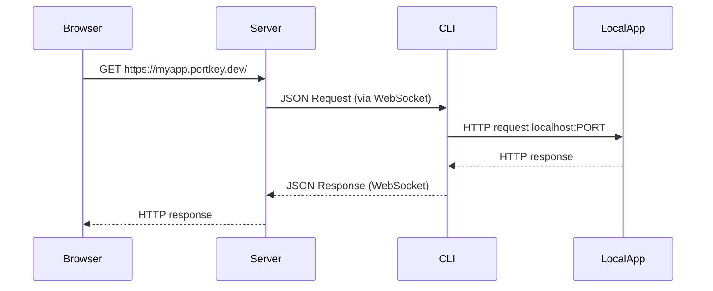

# 🪄 Portkey – Iteration 1: Core Tunneling MVP

Portkey lets you expose a local port to the internet through a secure, token-ready tunnel.
This README documents the **Iteration 1** milestone – a minimal but functional tunnel built with Go.

---

## ✨ Features Delivered

- `portkey-server` – accepts WebSocket tunnel connections and routes HTTP traffic to them.
- `portkey-cli` – establishes a persistent WebSocket tunnel and forwards requests to your local server.
- Sub-domain registry (in-memory, concurrency-safe).
- Black-box integration test proving end-to-end request flow.
- Container images via multi-stage Dockerfiles.

---

## 🏎️ Quick Start

```bash
# 1. Clone & build
make build          # or: go build -o bin/portkey-server ./cmd/server
                    #       go build -o bin/portkey-cli    ./cmd/client

# 2. Start the server (listen on 8080)
./bin/portkey-server -addr :8080

# 3. Start your local app (example React dev server)
cd myapp && npm run dev           # assumes it listens on :3000

# 4. Run portkey-cli to expose it
./bin/portkey-cli --server http://localhost:8080 \
                --subdomain myapp \
                --port 3000

# 5. From another terminal / browser
curl -H "Host: myapp.localhost" http://localhost:8080/
```

You should see your local application’s response.

---

## 🧩 Directory Layout

```
cmd/
  server/   → main for portkey-server
  client/   → main for portkey-cli
internal/
  registry/ → subdomain → connection map
  tunnel/   → JSON message schemas
integration/ → black-box integration test
Dockerfile[.client] → multi-stage containers
```

---

## 🔌 How It Works



---

## 🐳 Docker

Build images:

```bash
docker build -t portkey/server   -f Dockerfile        .
docker build -t portkey/client   -f Dockerfile.client .
```

Run:

```bash
docker run -p 8080:8080 portkey/server
```

Then start the CLI container and point it at the server container’s address.

---

## 🧪 Tests

- Unit tests: `go test ./...`
- Black-box integration test: `go test ./integration -v`

---

## 🚧 Next Iterations

1. **Token-Based Authentication** – secure tunnel creation.
2. Embedded Caddy for TLS termination.
3. Web UI for real-time request logging.

Refer to `SPEC.md` for the full roadmap.
